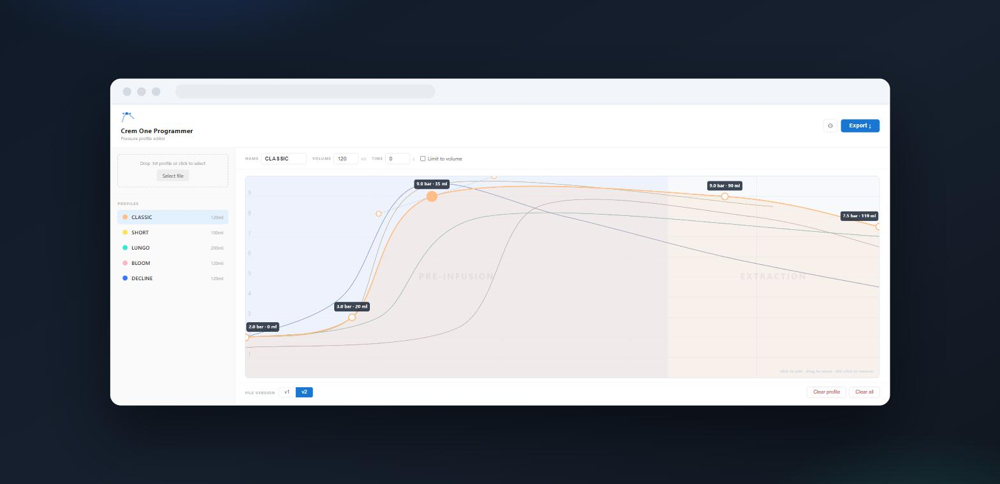

<p align="center">
  
</p>

<h1 align="center">Crem One Programmer</h1>

<p align="center">
  A pressure profile editor for the <a href="https://cremcoffee.com/">Crem One</a> espresso machine.<br>
  It reads the machine's profile file, lets you reshape all five profiles by dragging<br>
  curves around, and writes a new file you can load back onto the machine.
</p>

<p align="center">
  
</p>

It's a static page — no build step, no dependencies, no network access. Open it and it works,
from a web server or straight off your disk.

---

## Getting started

Clone or download the repository and open `OneProfileProgrammer.html` in a browser.

```sh
git clone https://github.com/LxO96/One-Programmer.git
cd One-Programmer
start OneProfileProgrammer.html      # Windows
open  OneProfileProgrammer.html      # macOS
```

There is nothing to install and nothing to build. A first-run walkthrough explains the
editor; you can bring it back later from **⚙ → Show the intro again**.

Everything runs locally. Your profiles are never uploaded anywhere.

---

## Reading the graph

Volume runs left to right, pressure runs bottom to top from 0 to 10 bar. The curve is the
pressure the machine holds at each point of the shot.

**The volume axis counts water through the pump, not what lands in the cup.** Roughly
120ml through the pump is a 36ml double espresso — a ratio of about 3.3 to 1. Every
millilitre in this editor, and in the profile file, is a pump millilitre.

The shaded band on the left is **pre-infusion**: low pressure that wets the puck evenly
before the shot proper, which helps avoid channelling. The Crem One pre-infuses for the
first 80ml, which is the default. The rest is **extraction**, where the curve actually
pulls the shot.

The four profiles you are *not* editing are drawn behind the active one in muted colour.
They share the same millilitre axis rather than being stretched to the width of the graph,
so pressures line up at the same point of the shot — which means a profile longer than the
one you're editing genuinely runs off the right edge.

---

## Editing

| Action | Gesture |
| --- | --- |
| Add a point | Click (or tap) anywhere on the graph |
| Move a point | Drag it |
| Reveal its handles | Click the point |
| Bend the curve | Drag a handle |
| Remove a point | Double-click (or double-tap) it |
| Read off a value | Hover — a vertical cursor tracks the pointer |

Each point has two handles that share a direction but have independent lengths, so a point
can be approached gently and left sharply without putting a kink in the curve. Handles are
always drawn far enough from their point to stay grabbable, even when they have been pulled
right in.

The editor will not let you draw a curve that doubles back on itself. A cubic bezier is only
single-valued in x while its control points stay ordered along the axis, so handles that
would break that ordering are shortened along their own direction — you keep the tangent you
drew, only its reach is trimmed. Without this you can produce a curve with two pressures at
the same volume, which the machine cannot execute.

The editor works on a phone. Touch targets grow for fingers, the panels stack, and the
profile list becomes a swipeable row.

---

## Presets

Opening the editor without loading a file gives you five starting profiles. The "out" figures
are the pump volume divided by 3.3.

| Name | Volume | ≈ In the cup | Shape |
| --- | --- | --- | --- |
| `CLASSIC` | 120ml | 36ml | Brief wetting, quick ramp to 9 bar, long hold |
| `SHORT` | 100ml | 30ml | Shorter and thicker, same peak pressure |
| `LUNGO` | 200ml | 60ml | More water at gentler pressure |
| `BLOOM` | 120ml | 36ml | Long soft pre-infusion, for light roasts |
| `DECLINE` | 120ml | 36ml | Peak early then ease off, the lever-machine shape |

No profile is shorter than the 80ml pre-infusion — below that a shot would be all
pre-infusion and no extraction.

These are starting points, not recommendations. Grind, dose and bean matter far more than the
curve does.

---

## Loading and exporting

Drop a `.txt` profile onto the panel at the top left, or use **Select file**. The version is
detected from the file's length, and the curves are reconstructed from the pressure values by
simplifying them into control points.

To write a file, pick the version your machine expects and press **Export**. The download is
named `IMPONE`.

**Clear profile** empties the profile you're editing; **Clear all** empties all five. Both ask
first. Clearing keeps the name and volume, since those describe the slot on the machine rather
than the curve.

### File format

Plain text, carriage-return delimited, five profile blocks one after another:

```
TYPE:P
INDEX: 0
NAME:CLASSIC
ML: 120
TIME:   0
  0: 2.0
  1: 2.0
  2: 2.0
  ...
```

| | Steps per profile | Resolution | Lines per block |
| --- | --- | --- | --- |
| **v1** | 60 | 4ml | 66 |
| **v2** | 240 | 1ml | 246 |

`ML` is the profile's volume, `TIME` an optional time limit in seconds, and each numbered line
is the pressure in bar at that step. If you are unsure which version your machine wants, keep
a copy of the file you started from and compare.

---

## Settings

**⚙** opens the settings. The pre-infusion length is global, shared by all five profiles, and
defaults to the 80ml the machine itself uses.

It is a drawing guide only — the profile file has no pre-infusion field, so this value is not
exported to the machine. Change it only if your machine is set up differently.

Settings are stored in `localStorage`. Opening the page over `file://` makes some browsers
treat the origin as opaque and refuse storage entirely; the editor falls back to keeping
settings in memory for the session rather than failing.

---

## Project layout

```
OneProfileProgrammer.html   markup, dialogs and the intro walkthrough
programmer.js               curve maths, canvas rendering, import and export
settings.js                 settings store, modals, canvas zone labels
proggStyle.css              all styling, including the responsive rules
docs/superpowers/           design notes and plans
```

`settings.js` must load before `programmer.js` — the first canvas paint reads the
pre-infusion setting.

---

## Tests

```sh
node test/run.js            # everything
node test/run.js ghosts     # just the files whose name matches
VERBOSE=1 node test/run.js  # show each assertion, not just the counts
```

Node is the only requirement — there is no framework and nothing to install. Each file
loads `programmer.js` and `settings.js` into a `vm` context with a stubbed DOM and canvas,
so the tests drive the code the browser actually runs rather than a copy of it.

The interesting ones are `monotonic` (a curve can never carry two pressures at one volume),
`fuzz` (20,000 randomised drag sequences checking the same), `roundtrip` (a profile through
import and back out, and an exported file read back in), and `import` (every malformed file
shape is refused with a readable message and leaves your loaded profiles untouched).

Worth knowing what they can and cannot tell you: they cover geometry, parsing, export and
state, and they run against the real source. They do not cover rendering — a stub canvas
records what was asked of it, not what a human would see — so anything visual still needs a
look in a browser.

---

## Caveats

- Profiles are not saved between visits. Closing the tab loses unexported work, so export
  anything you want to keep.
- There is no undo. The clear actions confirm first; nothing else does.
- The intro's animated diagrams use SMIL, which every current browser supports but which is
  formally deprecated. They are decorative; nothing breaks without them.

---

## Licence

No licence has been chosen yet, which means default copyright applies. If you want others to
be able to use or modify this, add one.
